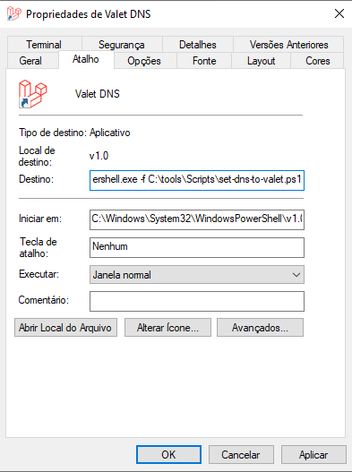
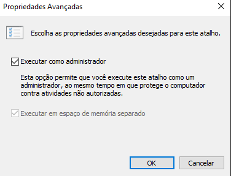

# windows10-laravel-valet-install-tips
## Dicas para instalar o Laravel Valet no Windows 10

## Aviso:
Esse repositório é resultado de minhas pesquisas e experimentações pessoais no caminho de criar um ambiente de desenvolvimento para trabalhar com o framework Laravel.  Agradeço a todos aqueles que criaram as maravilhosas ferramentas que me permitem, diariamente, estudar e codificar, sem ter dúvidas de que o código vai rodar (_a não ser, claro, pelos meus próprios erros_)!  O que reuni aqui funciona para mim.  Espero que funcione para você!


## Motivações para criar esse repositório:
* ajudar aqueles que precisam rodar um ambiente de desenvolvimento Laravel enxuto no Windows 10 de forma rápida e simples e, por algum motivo (falta de conhecimento/tempo/hardware) não podem rodar o Docker.
* aprimorar o meu conhecimento em Markdown ao redigir esse documento.
* tentar devolver à comunidade de código aberto - em especial aos criadores do PHP, Laravel, VS Code, Acrylic DNS, `valet-windows`, nginx, Apache, DBeaver, MySQL, MariaDB - as maravilhas que foram e são criadas diariamente e que ajudam milhões de pessoas ao redor do mundo.

## Sobre o Laravel Valet:
Segundo a [documentação do Laravel Valet](https://laravel.com/docs/8.x/valet), em tradução livre:
> Valet é um ambiente de desenvolvimento Laravel para minimalistas macOS. O Laravel Valet configura seu Mac para sempre rodar o Nginx em segundo plano quando sua máquina for inicializada. Em seguida, usando DnsMasq, Valet faz proxy de todas as solicitações no domínio * .test para apontar para sites instalados em sua máquina local.
> Em outras palavras, Valet é um ambiente de desenvolvimento Laravel extremamente rápido que usa cerca de 7 MB de RAM. Valet não é um substituto completo para Sail ou Homestead, mas oferece uma ótima alternativa se você deseja um básico flexível, prefere velocidade extrema ou está trabalhando em uma máquina com uma quantidade limitada de RAM.

O detalhe é que eu não tenho um Mac.  Com isso, fuçando no Google, achei a maravilhosa versão criada pelo [Cretu Eusebiu](https://github.com/cretueusebiu): [_Laravel Valet (windows port)_](https://github.com/cretueusebiu/valet-windows)

Com o Valet instalado, basta você chegar no diretório dos seus projetos e rodar, por exemplo, o seguinte comando:
```
c:
cd \Users\cpereiraweb\OneDrive\Code
valet park
```

Considere que o `valet` esteja ativo e o meu diretório `Code` tenha a seguinte estrutura:
```
 Pasta de C:\Users\cpereiraweb\OneDrive\Code

25/02/2021  19:56    <DIR>          .
25/02/2021  19:56    <DIR>          ..
21/12/2020  14:04    <DIR>          projeto1
22/12/2020  18:26    <DIR>          projeto2
17/12/2020  20:48    <DIR>          projeto3
22/12/2020  12:54    <DIR>          projeto4
24/12/2020  13:21    <DIR>          laravel-tailwind-sandbox
...
```

Bastará, então, abrir o navegador e digitar *http://projeto1.test* e pronto!

Ou então:
```
cd projeto1
valet open
```

O endereço _projeto1.test_ será aberto no navegador padrão do sistema.

Não vou me demorar aqui no Valet.  Para mais informações, consulte a [documentação do Laravel](https://laravel.com/docs/8.x/valet).

### Referências:
* Laravel Docs: https://laravel.com/docs/8.x/valet
* PHP 7.4: https://www.php.net/downloads.php#v7.4.15
* Laravel Valet for Windows by [Cretu Eusebiu](https://github.com/cretueusebiu): https://github.com/cretueusebiu/valet-windows
* Acrylic DNS Proxy for Windows:
  * Download: https://mayakron.altervista.org/support/acrylic/Home.htm
  * Configuração: http://mayakron.altervista.org/support/acrylic/Windows10Configuration.htm
* MySQL Community Server: https://dev.mysql.com/downloads/mysql/
* XAMPP https://www.apachefriends.org/pt_br/index.html
  * _Por quê o XAMPP está aqui? Pra quem tem pressa/preguiça, rode o instalador dele e use só o MySQL_.
* DBeaver Community Edition: https://dbeaver.io/ _Database Manager_
* VS Code: https://code.visualstudio.com/
  * Laravel Extension Pack: https://marketplace.visualstudio.com/items?itemName=onecentlin.laravel-extension-pack
  * Lista de extensões Laravel do [Bobby Iliev](https://devdojo.com/bobbyiliev): https://devdojo.com/bobbyiliev/8-awesome-vs-code-extensions-for-laravel-developers

# Scripts PowerShell para mudar a configuração de rede
Quando o Valet está ativo ele usa o Acrylic DNS Proxy para interceptar as chamadas das URL dos seus projetos e, então atendê-las com o `nginx`.  Para que isso funcione, a sua configuração de rede deve ter o DNS SERVER fixado.  Como eu não queria deixar isso ativo de forma permanente criei dois scripts em PowerShell para manipular as configurações da minha interface de rede para mim.

*Observação 1: o nome da minha interface de rede é _Wi-Fi_.  No código abaixo, mude para o nome da sua interface.*

*Observação 2: eu criei o diretório `C:\tools` para concentrar os scripts e apps nele.  Você pode até criar um repo do seu, depois de ajustado, e deixar no Github pra poder instalar onde quiser.*

*Observação 3: eu salvei esses arquivos em `C:\tools\Scripts` e coloquei esse caminho no `PATH` do Windows.*


### set-dns-to-valet.ps1
```powershell
Set-DnsClientServerAddress -InterfaceAlias Wi-Fi -ServerAddresses "127.0.0.1"
Set-DnsClientServerAddress -InterfaceAlias Wi-Fi -ServerAddresses ::1
Get-DnsClientServerAddress
pause
exit
```

### set-dns-to-dhcp.ps1
```powershell
Set-DnsClientServerAddress -InterfaceAlias Wi-Fi -ResetServerAddresses
Get-DnsClientServerAddress
pause
exit
```

### Atalhos do Windows:
Na minha Área de Trabalho eu criei dois atalhos para esses arquivos com esses parâmetros:
No campo _Destino_ entra esse código:
```
C:\Windows\System32\WindowsPowerShell\v1.0\powershell.exe -f C:\tools\Scripts\set-dns-to-valet.ps1
```
No campo _Iniciar em: entra esse código (_pode ser diferente no seu sistema!_):
```
C:\Windows\System32\WindowsPowerShell\v1.0
```


Clique no botão *Avançados..* e marque a opção _Executar como administrador_:



# Instalação dos executáveis

1. Instale o PHP.  Eu criei o diretório `C:\tools\` para me facilitar.  Com isso o PHP 7.4 ficou em `C:\tools\php74`
2. Instale o MySQL.  Nesse caso eu preferi o XAMPP apenas para usar o ícone do app para ligar/desligar o MySQL.
3. Instale o Acrylic DNS Proxy *mas não o ative ainda*. 

# Rotina de trabalho

Quando eu vou começar a programar, sigo essa ordem:
1. Num prompt como Admin, executo `valet start`
2. Inicio o MySQL
3. Clico no atalho do `set-dns-to-valet.ps1` para configurar a rede para o Acrylic DNS Proxy

*Pronto! Agora é só abrir o seu projeto e começar a codar!*